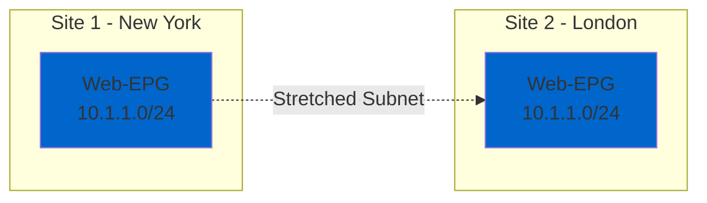
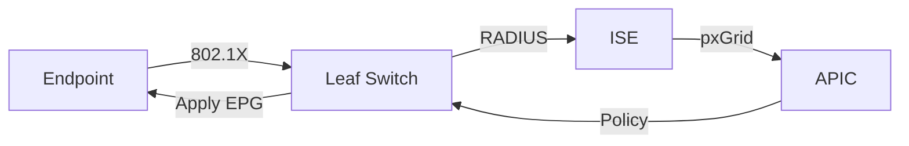

# Cisco ACI Fabric Design Guide

**Document Version:** 1.0  
**Last Updated:** October 10, 2025  
**Status:** ✅ Production Ready

---

## 📋 Table of Contents

- [Overview](#overview)
- [Design Principles](#design-principles)
- [Fabric Topologies](#fabric-topologies)
- [Tenant Architecture](#tenant-architecture)
- [Multi-Site Design](#multi-site-design)
- [Service Integration](#service-integration)
- [Scaling Guidelines](#scaling-guidelines)

---

## 🎯 Overview

### What is Cisco ACI?

Cisco Application Centric Infrastructure (ACI) is a software-defined networking (SDN) solution that provides:

- **Policy-based automation** - Application-centric policy model
- **Centralized management** - Single pane of glass via APIC
- **Hardware-based forwarding** - Line-rate performance
- **Multi-hypervisor support** - VMware, Hyper-V, KVM, OpenStack
- **Multi-tenancy** - Complete isolation between tenants

### Design Goals

✅ Scalable to 10,000+ endpoints  
✅ High availability (99.99% uptime)  
✅ Zero-trust micro-segmentation  
✅ Automated policy enforcement  
✅ Multi-site stretched L2/L3 domains

---

## 🏗️ Design Principles

### ACI Object Hierarchy

```
Tenant
├── VRF (Virtual Routing & Forwarding)
│   ├── Bridge Domain (BD)
│   │   ├── Subnet
│   │   └── L3Out (External connectivity)
│   └── Contract (Policy)
│       ├── Subject
│       └── Filter (ACL rules)
└── Application Profile
    └── EPG (Endpoint Group)
        ├── Physical Domain (Bare-metal)
        ├── VMM Domain (Virtual)
        └── External EPG (Outside networks)
```

### Fabric Components

| Component | Role | Quantity |
|-----------|------|----------|
| **APIC** | Controller cluster | 3-5 nodes (HA) |
| **Spine** | L3 fabric interconnect | 2-4 nodes |
| **Leaf** | ToR access switches | N nodes (scale as needed) |
| **IPN** | Inter-Pod Network (optional) | For multi-site |

---

## 🌐 Fabric Topologies

### Single Pod Design

**Use Case:** Single datacenter, up to 400 leaf switches

```
         [APIC Cluster]
              |
    ┌─────────┴─────────┐
    |                   |
[Spine-1]          [Spine-2]
    |                   |
    └─────────┬─────────┘
         Full Mesh
    ┌─────────┼─────────┐
    |         |         |
[Leaf-1] [Leaf-2] [Leaf-N]
    |         |         |
[Servers] [Network] [Storage]
```

**Characteristics:**
- All leafs connect to all spines (full mesh)
- East-west traffic: 1 hop (leaf-spine-leaf)
- North-south traffic: Via border leafs with L3Out
- Latency: <10 microseconds

### Multi-Pod Design

**Use Case:** Multiple datacenters in same metro area

```
Pod-1 (DC1)              IPN              Pod-2 (DC2)
┌──────────────┐    ┌────────────┐    ┌──────────────┐
│  [APIC-1,2]  │    │  [Routers] │    │   [APIC-3]   │
│              │    │            │    │              │
│ [Spine-1,2]  │◄──►│ [Spine-X]  │◄──►│ [Spine-3,4]  │
│              │    │            │    │              │
│ [Leaf-1..N]  │    │            │    │ [Leaf-N..M]  │
└──────────────┘    └────────────┘    └──────────────┘
```

**Characteristics:**
- Pods connected via IPN (Inter-Pod Network)
- Single APIC cluster manages all pods
- Stretched L2/L3 across pods
- IPN requirement: <50ms RTT

### Multi-Site Design

**Use Case:** Geographically distributed datacenters

```
     Site-1 (New York)          Site-2 (London)          Site-3 (Tokyo)
    ┌──────────────────┐      ┌──────────────────┐      ┌──────────────────┐
    │  [APIC Cluster]  │      │  [APIC Cluster]  │      │  [APIC Cluster]  │
    │                  │      │                  │      │                  │
    │   [ACI Fabric]   │      │   [ACI Fabric]   │      │   [ACI Fabric]   │
    └─────────┬────────┘      └─────────┬────────┘      └─────────┬────────┘
              │                         │                          │
              └─────────────────────────┴──────────────────────────┘
                          [Multi-Site Orchestrator]
                            (Central Management)
```

**Characteristics:**
- Independent APIC clusters per site
- Multi-Site Orchestrator for cross-site policy
- Stretched EPGs with VXLAN EVPN
- Active-active or active-standby

---

## 🏢 Tenant Architecture

### Tenant Design Strategy

#### Common Tenant
- **Purpose:** Shared services (DNS, NTP, AD)
- **Access:** All tenants can consume
- **Example:** Corporate infrastructure services

#### Production Tenant
- **Purpose:** Business-critical applications
- **Isolation:** Strict security policies
- **Example:** ERP, CRM, financial systems

#### Development Tenant
- **Purpose:** Dev/test environments
- **Isolation:** Separate from production
- **Example:** CI/CD pipelines, sandbox

### VRF Design Patterns

**Option 1: One VRF Per Tenant**
```
Tenant: Finance
└── VRF: Finance-VRF
    ├── BD: Web-Tier
    ├── BD: App-Tier
    └── BD: DB-Tier
```

**Option 2: Multiple VRFs Per Tenant**
```
Tenant: Enterprise
├── VRF: DMZ-VRF (public-facing)
├── VRF: Internal-VRF (corporate)
└── VRF: Management-VRF (admin)
```

### EPG Design Best Practices

#### Micro-Segmentation Model
- **One EPG per application tier**
- Example: Web-EPG, App-EPG, DB-EPG
- Contracts define inter-tier communication

#### Macro-Segmentation Model
- **One EPG per security zone**
- Example: Trusted-EPG, Untrusted-EPG, DMZ-EPG
- Simpler but less granular

#### Hybrid Model (Recommended)
- Combine both approaches
- Critical apps: Micro-segmentation
- Less critical: Macro-segmentation

---

## 🌍 Multi-Site Design

### Deployment Models

#### Active-Active
- Both sites serve traffic simultaneously
- Global load balancing required
- Best for: Read-heavy workloads, DR scenarios

#### Active-Standby
- Primary site handles all traffic
- Standby site for disaster recovery
- Best for: Write-heavy databases, compliance requirements

### Stretched EPG Design



**Requirements:**
- L2 extension via VXLAN EVPN
- BGP EVPN control plane
- Anycast gateway on both sites

### Inter-Site Connectivity Options

1. **MPLS L3VPN** - Service provider backbone
2. **Dark Fiber** - Direct optical connection
3. **Internet VPN** - Encrypted over public internet
4. **CloudSEC** - Via Equinix Cloud Exchange

---

## 🔌 Service Integration

### Firewall Insertion

**Option 1: Go-Through Mode (Routed)**
```
[Leaf] → [Firewall] → [Leaf]
         (L3 routing)
```

**Option 2: Go-To Mode (One-Arm)**
```
[Leaf] → [Service Graph] → [Firewall]
         (Policy-based redirect)
```

### Load Balancer Integration

**Service Graph Example:**
```
Client → [Web-EPG] → [LB-EPG] → [App-EPG]
         (Contract)   (L4-L7)   (Contract)
```

### Integration with ISE



**Benefits:**
- Dynamic EPG assignment based on user identity
- Automatic quarantine of non-compliant devices
- Guest access with captive portal

---

## 📊 Scaling Guidelines

### Fabric Sizing

| Scale Factor | Small | Medium | Large |
|--------------|-------|--------|-------|
| Endpoints | <1,000 | 1,000-5,000 | >5,000 |
| Leaf Switches | 2-10 | 10-50 | 50-400 |
| Spine Switches | 2 | 2-4 | 4-8 |
| Tenants | 1-5 | 5-20 | 20-100 |
| EPGs per Tenant | <50 | 50-200 | 200-500 |

### Performance Considerations

**Spine Uplink Bandwidth:**
- Leaf-to-Spine: 40G or 100G per link
- Oversubscription ratio: 3:1 to 4:1 recommended

**Leaf Switch Selection:**
- Fixed ports: Nexus 9300 series
- Modular: Nexus 9500 series
- Buffer requirements: Web/App (standard), Storage (deep buffer)

### APIC Cluster Sizing

| Deployment | APIC Count | HA Level |
|------------|------------|----------|
| Lab/PoC | 1 | None |
| Production (Small) | 3 | N+1 |
| Production (Large) | 5 | N+2 |
| Multi-Site | 3-5 per site | Site-level HA |

---

## 🎓 Design Decision Matrix

| Requirement | Recommendation |
|-------------|----------------|
| High availability | 3+ APIC, 2+ spine, redundant leafs |
| Multi-datacenter | Multi-Site with MSO |
| Firewall integration | Service graphs with PBR |
| Guest access | ISE integration with pxGrid |
| Micro-segmentation | EPG per app tier + contracts |
| VM mobility | VMM integration (vCenter/SCVMM) |
| Container workloads | ACI CNI plugin for Kubernetes |

---

## 📚 References

- [Cisco ACI Design Guide (CVD)](https://www.cisco.com/c/en/us/solutions/data-center-virtualization/application-centric-infrastructure/design-zone.html)
- [ACI Fabric Endpoint Learning Whitepaper](https://www.cisco.com/c/en/us/solutions/collateral/data-center-virtualization/application-centric-infrastructure/white-paper-c11-739609.html)
- [Multi-Site Orchestrator Documentation](https://www.cisco.com/c/en/us/support/cloud-systems-management/multi-site-orchestrator/series.html)

---

*Last updated: October 10, 2025*