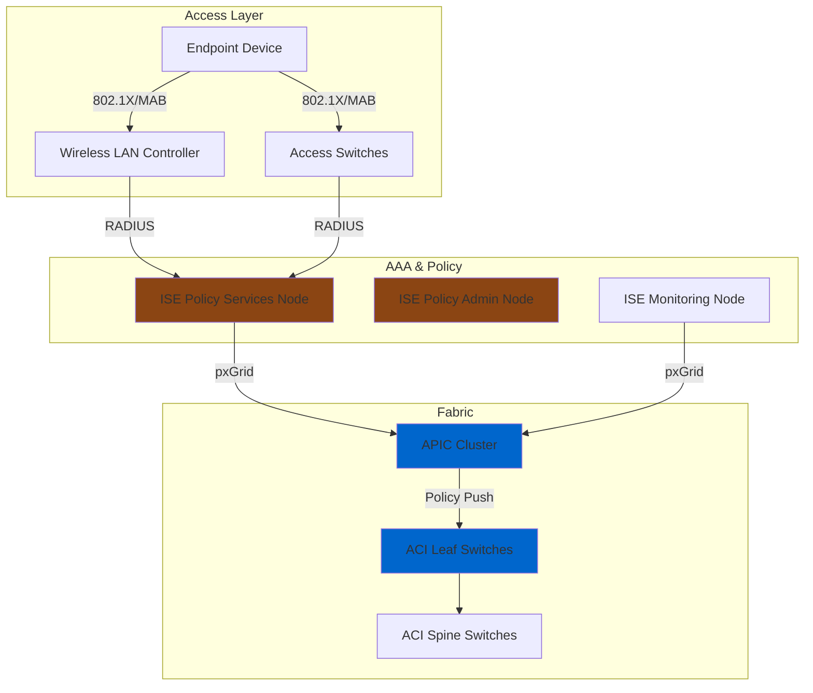
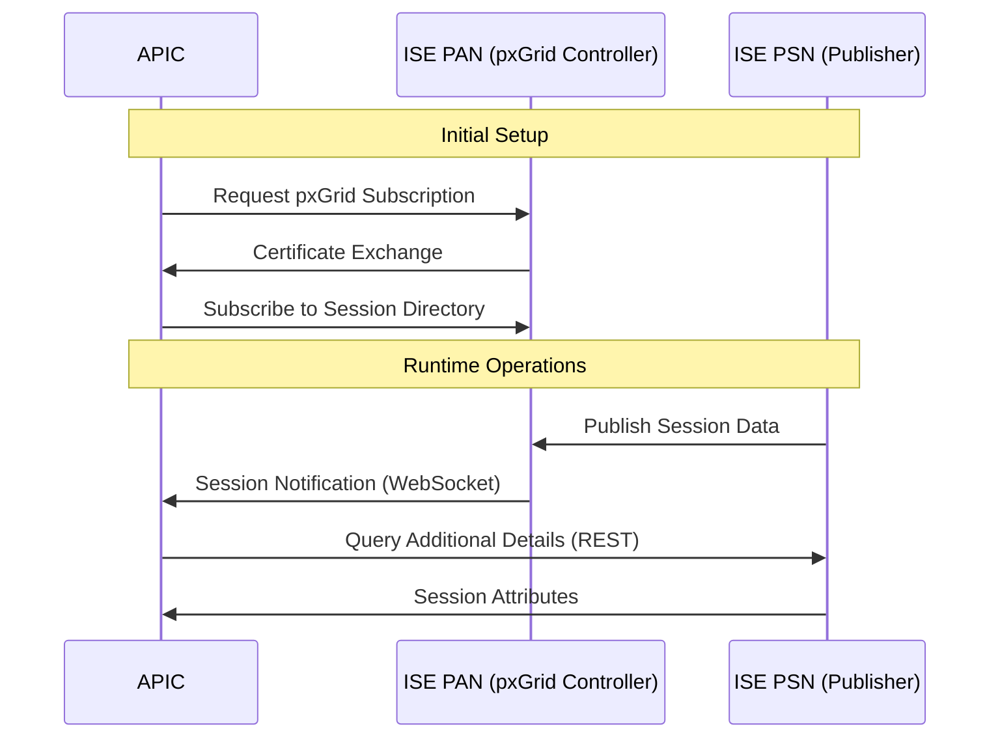
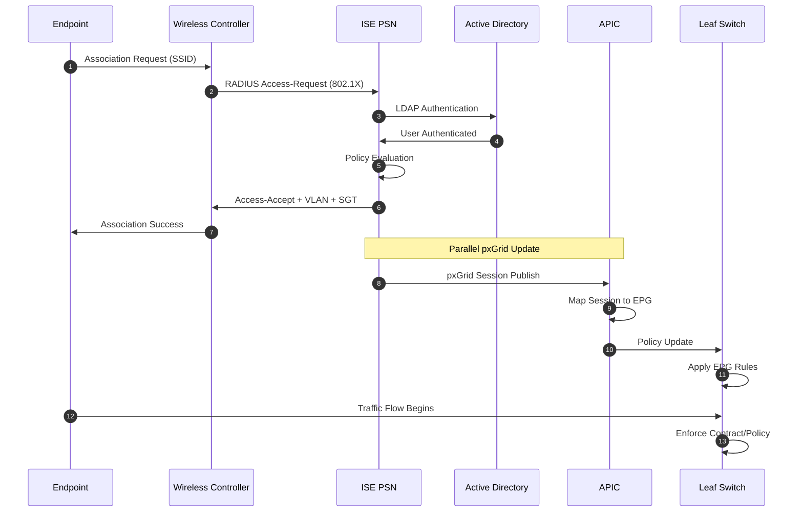

# Cisco ACI + ISE Integration Flows

**Document Version:** 1.0  
**Last Updated:** October 10, 2025  
**Author:** Network Architecture Team  
**Status:** ✅ Production Ready

---

## 📋 Table of Contents

- [Overview](#overview)
- [Integration Architecture](#integration-architecture)
- [pxGrid Communication](#pxgrid-communication)
- [Authentication Flow](#authentication-flow)
- [Dynamic EPG Assignment](#dynamic-epg-assignment)
- [Session Lifecycle](#session-lifecycle)
- [Failure Scenarios](#failure-scenarios)
- [Performance Considerations](#performance-considerations)

---

## 🎯 Overview

### Purpose

This document describes the end-to-end integration between Cisco Application Centric Infrastructure (ACI) and Cisco Identity Services Engine (ISE) using pxGrid (Platform Exchange Grid) for dynamic security policy enforcement.

### Integration Benefits

✅ **Dynamic Segmentation** - Automatic endpoint grouping based on identity  
✅ **Policy Automation** - Centralized policy management through ISE  
✅ **Enhanced Visibility** - Unified view of users, devices, and network state  
✅ **Rapid Response** - Real-time security posture updates  
✅ **Compliance** - Audit trails for access control decisions

### Use Cases

1. **Guest Wireless Access** - Captive portal with temporary network access
2. **BYOD Onboarding** - Device profiling and policy assignment
3. **Zero Trust Segmentation** - Micro-segmentation based on user/device identity
4. **Quarantine Enforcement** - Automatic isolation of non-compliant endpoints
5. **IoT Device Management** - Profiling and segregation of IoT devices

---

## 🏗️ Integration Architecture

### High-Level Architecture

### Component Roles

| Component | Role | Integration Point |
|-----------|------|-------------------|
| **Endpoint** | User device, IoT sensor, guest laptop | 802.1X, MAB, WebAuth |
| **WLC/Switch** | Network access device (NAD) | RADIUS client |
| **ISE PSN** | Authentication, authorization, profiling | RADIUS server, pxGrid publisher |
| **ISE PAN** | Policy administration | pxGrid controller |
| **ISE MnT** | Monitoring and troubleshooting | pxGrid publisher (session data) |
| **APIC** | ACI policy controller | pxGrid subscriber |
| **Leaf Switch** | Policy enforcement point | Dynamic EPG assignment |

---

## 🔗 pxGrid Communication

### What is pxGrid?

**Platform Exchange Grid (pxGrid)** is a Cisco open platform that enables sharing of contextual data between security and network systems.

**Key Features:**
- Bidirectional publish/subscribe messaging
- RESTful and WebSocket APIs
- TLS encryption for all communications
- Certificate-based authentication

### pxGrid Topics Used in ACI Integration

| Topic | Publisher | Subscriber | Data Shared |
|-------|-----------|------------|-------------|
| **Session Directory** | ISE PSN/MnT | APIC | Active sessions, user identity, device type |
| **Endpoint Profile** | ISE PSN | APIC | Device profiling data |
| **Security Group** | ISE PAN | APIC | Security Group Tag (SGT) mappings |
| **System Health** | ISE | APIC | ISE node status |

### Communication Flow Diagram

### pxGrid Configuration Prerequisites

**On ISE:**
1. pxGrid service enabled on PAN
2. pxGrid certificates generated
3. pxGrid client approved (APIC)
4. Session Directory topic enabled

**On APIC:**
1. External endpoint group configured
2. ISE domain configured with pxGrid settings
3. Certificate imported
4. Subscription to ISE topics configured

---

## 🔐 Authentication Flow

### End-to-End Authentication Sequence

### Authentication Methods Supported

#### 802.1X (EAP)
- **Best for:** Corporate managed devices
- **Protocols:** PEAP-MSCHAPv2, EAP-TLS, EAP-FAST
- **Identity Source:** Active Directory, LDAP
- **Advantages:** Strong authentication, per-user policies

#### MAC Authentication Bypass (MAB)
- **Best for:** Headless devices (printers, IoT)
- **Method:** MAC address lookup
- **Identity Source:** ISE internal endpoints, Active Directory
- **Advantages:** No client configuration needed

#### WebAuth (Captive Portal)
- **Best for:** Guest access, BYOD registration
- **Method:** HTTP/HTTPS redirection to ISE portal
- **Identity Source:** Local users, sponsor approval, social login
- **Advantages:** User-friendly, self-service

---

## 