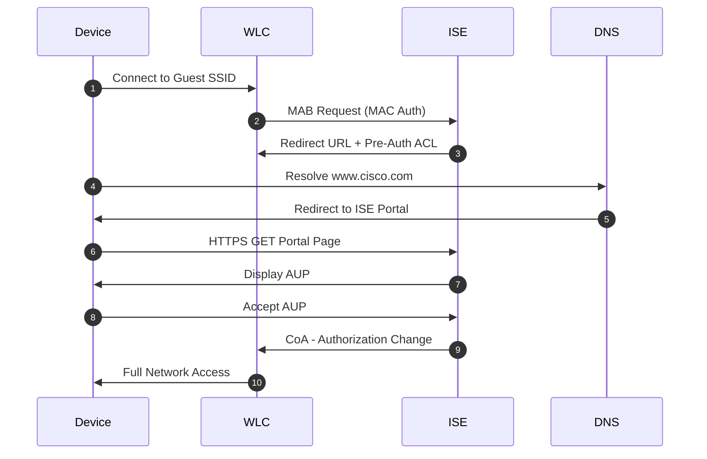
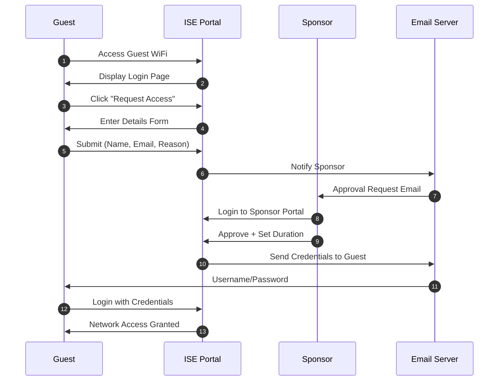
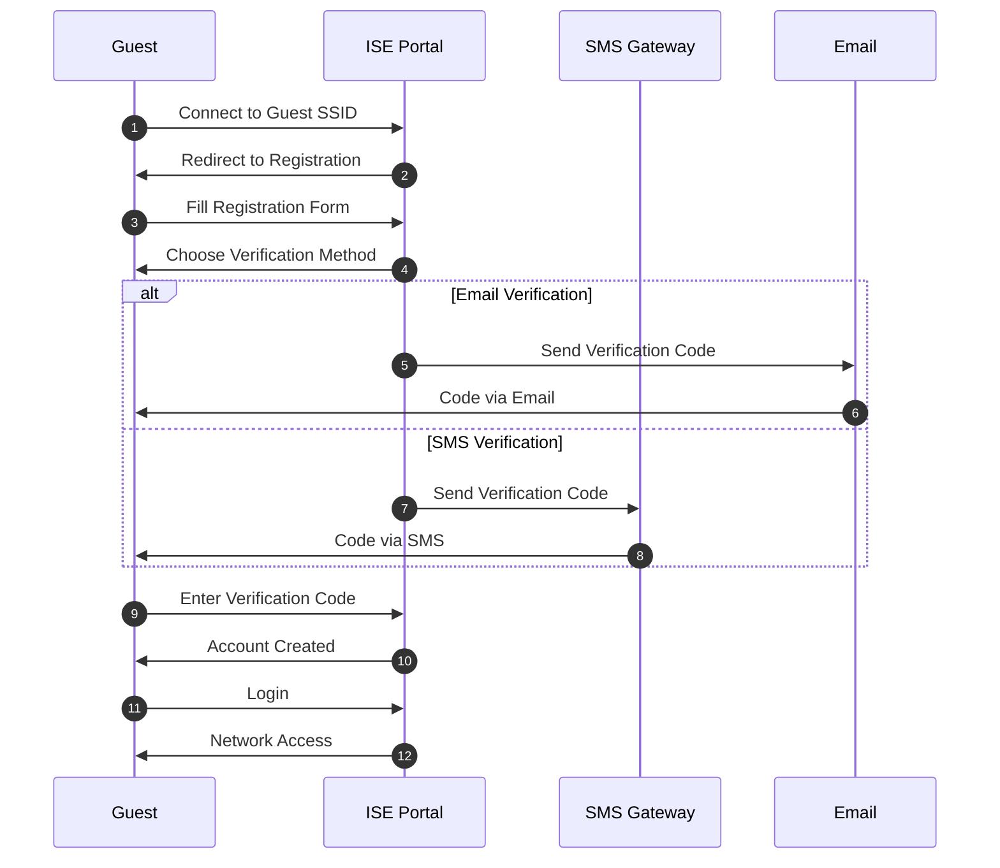

# Cisco ISE Captive Portal Design

**Document Version:** 1.0  
**Last Updated:** October 10, 2025  
**Status:** ✅ Production Ready

---

## 📋 Table of Contents

- [Overview](#overview)
- [Portal Types](#portal-types)
- [Guest Access Workflows](#guest-access-workflows)
- [High Availability Design](#high-availability-design)
- [Authentication Methods](#authentication-methods)
- [Customization Guide](#customization-guide)
- [Security Hardening](#security-hardening)

---

## 🎯 Overview

### What is ISE Captive Portal?

A **captive portal** is a web page displayed to users before they're granted network access. Cisco ISE provides enterprise-grade captive portal functionality for:

- **Guest Access** - Temporary network access for visitors
- **BYOD Onboarding** - Self-service device registration
- **Acceptable Use Policy (AUP)** - Terms acceptance before access
- **Device Registration** - MAC address registration for headless devices

### Use Cases

✅ **Corporate Guest WiFi** - Visitors, contractors, vendors  
✅ **University Campus** - Students, faculty, visitors  
✅ **Retail/Hospitality** - Customers in stores, hotels, restaurants  
✅ **Healthcare** - Patients, visitors (HIPAA compliant)  
✅ **Events/Conferences** - Temporary high-density access

---

## 🔐 Portal Types

### 1. Hotspot Guest Portal

**Characteristics:**
- No authentication required
- Click-through AUP only
- MAC-based tracking
- Time/bandwidth limits

**Use Case:** Coffee shops, retail stores, public waiting areas

**Flow:**
```
Connect → Redirect → Accept AUP → Internet Access
```

### 2. Self-Registered Guest Portal

**Characteristics:**
- User creates own credentials
- Email/SMS verification
- Optional sponsor approval
- Account expiration

**Use Case:** Corporate offices, universities, conferences

**Flow:**
```
Connect → Redirect → Register → Email Verify → Login → Access
```

### 3. Sponsored Guest Portal

**Characteristics:**
- Requires sponsor approval
- Sponsor creates guest accounts
- Email notification to guest
- Audit trail maintained

**Use Case:** Enterprise environments, secure facilities

**Flow:**
```
Request → Sponsor Approves → Guest Receives Email → Login → Access
```

### 4. Device Registration Portal

**Characteristics:**
- Register MAC addresses
- For headless devices (printers, IoT)
- Employee self-service
- Device limits per user

**Use Case:** BYOD policies, IoT device management

**Flow:**
```
Connect → Login → Register Device MAC → Device Auto-Authenticated
```

---

## 🔄 Guest Access Workflows

### Hotspot Portal Workflow



### Sponsored Guest Workflow



### Self-Registration Workflow



---

## 🏗️ High Availability Design

### Deployment Models

#### Standalone (Lab Only)
```
┌─────────────┐
│  ISE Node   │
│ (All Roles) │
└─────────────┘
```

**Not recommended for production**

#### Small Deployment (2 Nodes)
```
┌──────────────────┐        ┌──────────────────┐
│   ISE Node 1     │◄──────►│   ISE Node 2     │
│ - PAN (Primary)  │        │ - PAN (Secondary)│
│ - MnT (Primary)  │        │ - MnT (Secondary)│
│ - PSN            │        │ - PSN            │
└──────────────────┘        └──────────────────┘
         ▲                           ▲
         │                           │
         └───────────┬───────────────┘
                     │
                [Load Balancer]
                (Guest Portal VIP)
```

#### Enterprise Deployment (6+ Nodes)
```
       ┌──────────────┐          ┌──────────────┐
       │ PAN Primary  │◄────────►│ PAN Secondary│
       └──────────────┘          └──────────────┘
              │                         │
       ┌──────┴─────────────────────────┴──────┐
       │                                        │
┌──────▼──────┐                          ┌─────▼───────┐
│ MnT Primary │                          │MnT Secondary│
└─────────────┘                          └─────────────┘
       │                                        │
       ├────────────────┬───────────────────────┤
       │                │                       │
┌──────▼──────┐  ┌──────▼──────┐        ┌──────▼──────┐
│   PSN-1     │  │   PSN-2     │  ....  │   PSN-N     │
│ (DC1)       │  │ (DC1)       │        │ (DC2)       │
└─────────────┘  └─────────────┘        └─────────────┘
       │                │                       │
       └────────────────┴───────────────────────┘
                        │
                   [Load Balancer]
                   (FQDN: guest.company.com)
```

**Roles:**
- **PAN** - Policy Administration Node (primary + secondary)
- **MnT** - Monitoring & Troubleshooting (primary + secondary)
- **PSN** - Policy Service Node (2+ for redundancy)

### Load Balancer Configuration

**Requirements:**
- Layer 7 load balancing
- SSL offloading OR passthrough
- Sticky sessions (source IP persistence)
- Health checks on HTTPS/8443

**F5 BIG-IP Example:**
```bash
# Create pool
create ltm pool ISE_Guest_Pool {
    load-balancing-mode least-connections-member
    monitor https_8443
    members add {
        10.1.1.101:8443 { }
        10.1.1.102:8443 { }
    }
}

# Create persistence profile
create ltm persistence source-addr ISE_Persistence {
    timeout 600
}

# Create virtual server
create ltm virtual ISE_Guest_VIP {
    destination 10.1.1.100:443
    pool ISE_Guest_Pool
    persist {
        ISE_Persistence { default yes }
    }
    profiles add {
        tcp { }
        http { }
        serverssl { context serverside }
    }
}
```

### Failover Scenarios

| Scenario | Impact | Failover Time | Action |
|----------|--------|---------------|--------|
| PSN node failure | Active sessions lost on that node | <5 seconds | New sessions to other PSNs |
| PAN primary failure | No policy changes possible | 0 (secondary promotes) | Secondary becomes primary |
| MnT primary failure | Logging disrupted | <30 seconds | Secondary collects logs |
| Load balancer failure | All guest access down | N/A | Deploy redundant LB pair |

---

## 🔑 Authentication Methods

### 1. Local User Database

**Use Case:** Small deployments, backup authentication

**Configuration:**
```
Administration → Identity Management → Identities → Users → Add
```

**Pros:** No external dependency  
**Cons:** Limited scalability, manual management

### 2. Active Directory Integration

**Use Case:** Enterprise environments with existing AD

**Configuration:**
```
Administration → Identity Management → External Identity Sources → Active Directory → Add
```

**Join Points:**
- DC1: dc1.company.com
- DC2: dc2.company.com (redundancy)

**Attributes Retrieved:**
- sAMAccountName (username)
- mail (email address)
- memberOf (group membership)

### 3. LDAP Integration

**Use Case:** Non-Windows environments

**Example (OpenLDAP):**
```
Server: ldap.company.com
Port: 636 (LDAPS)
Base DN: ou=users,dc=company,dc=com
Bind DN: cn=ise-bind,ou=service,dc=company,dc=com
```

### 4. RADIUS Token

**Use Case:** Guest self-registration without external auth

ISE generates random username/password:
- Username: guest_12345
- Password: Xy9#kL2p
- Duration: 8 hours

### 5. Social Login

**Supported Providers:**
- Facebook
- Google
- LinkedIn

**OAuth2 Flow:**
```
User → ISE Portal → Redirect to Social Provider → Authorize → Redirect Back → Access
```

**Privacy Note:** ISE only receives user identifier, not personal data

### 6. SMS Authentication

**Use Case:** Multi-factor authentication

**Supported Gateways:**
- Twilio
- Nexmo (Vonage)
- Generic HTTP/S endpoint

**Flow:**
```
Register → Provide Phone Number → Receive SMS Code → Enter Code → Verified
```

---

## 🎨 Customization Guide

### Portal Customization Levels

#### Level 1: Basic Branding
- Company logo
- Color scheme
- Welcome message

**Time to implement:** 15 minutes

#### Level 2: Content Modification
- Custom AUP text
- Multiple languages
- Help desk contact info

**Time to implement:** 1 hour

#### Level 3: Advanced Customization
- Custom HTML/CSS
- JavaScript widgets
- Third-party integrations

**Time to implement:** 4-8 hours

### Customization Steps

**1. Upload Company Logo:**
```
Guest Access → Portals & Components → Guest Portals → [Portal Name] →
Portal Page Customization → Pages → Logo → Upload Image
```

**Recommended:** 200x80 pixels, PNG with transparency

**2. Modify Color Scheme:**
```css
/* Custom CSS Example */
.main-container {
    background-color: #0066CC; /* Corporate blue */
}

.btn-primary {
    background-color: #FF6600; /* Corporate orange */
    border-color: #FF6600;
}

.login-title {
    font-family: 'Arial', sans-serif;
    color: #333333;
}
```

**3. Custom AUP Text:**
```
Guest Access → Portals & Components → Guest Portals → [Portal Name] →
Portal Page Customization → Pages → AUP → Edit
```

**Example AUP:**
```
By accessing this network, you agree to:
1. Comply with all applicable laws and regulations
2. Not attempt unauthorized access to systems
3. Not transmit malicious code or content
4. Allow monitoring of your network activity
5. Accept that access may be revoked at any time

Violations may result in legal action.
```

### Multi-Language Support

**Supported Languages:**
- English, Spanish, French, German, Italian
- Chinese (Simplified/Traditional), Japanese, Korean
- Portuguese, Russian, Polish, Turkish

**Configuration:**
```
Guest Access → Portals & Components → Guest Portals → [Portal Name] →
Languages → Select Languages → Import Translations
```

---

## 🔒 Security Hardening

### Certificate Requirements

**Types Needed:**
1. **Admin Certificate** - APIC GUI access (port 443)
2. **EAP Certificate** - 802.1X authentication (RADIUS)
3. **Portal Certificate** - Guest portal HTTPS (port 8443)
4. **pxGrid Certificate** - ACI integration

**Best Practices:**
- Use certificates from trusted public CA (for guest portal)
- Use internal CA for admin/EAP
- 2048-bit RSA minimum (4096-bit recommended)
- SHA-256 signing algorithm
- SAN (Subject Alternative Name) for multiple FQDNs

**Portal Certificate SAN Example:**
```
CN=guest.company.com
SAN:
  - guest.company.com
  - guest-backup.company.com
  - 10.1.1.100 (VIP address)
```

### SSL/TLS Configuration

**Minimum TLS Version:** TLS 1.2  
**Recommended Cipher Suites:**
```
TLS_ECDHE_RSA_WITH_AES_256_GCM_SHA384
TLS_ECDHE_RSA_WITH_AES_128_GCM_SHA256
TLS_DHE_RSA_WITH_AES_256_GCM_SHA384
```

**Disable:**
- SSLv3 (POODLE vulnerability)
- TLS 1.0 (deprecated)
- TLS 1.1 (deprecated)
- Weak ciphers (RC4, DES, 3DES)

### Access Control

**Pre-Authentication ACL (PACL):**
```
permit udp any any eq bootps
permit udp any any eq domain
permit tcp any host 10.1.1.100 eq 443
permit tcp any host 10.1.1.100 eq 8443
deny ip any any
```

**Post-Authentication ACL:**
```
permit ip any any
```

### Rate Limiting

**Protect against brute force:**
```
Administration → System → Settings → Protocols → RADIUS →
Failed Attempts: 5
Lockout Duration: 15 minutes
```

### Logging & Monitoring

**Enable Detailed Logging:**
```
Administration → System → Logging → Remote Logging Targets →
Add: Syslog Server (10.1.1.200:514)
```

**Alerts to Configure:**
- Failed login attempts threshold
- Portal certificate expiration (30 days)
- PSN node down
- Database replication failure

### GDPR Compliance

**Data Collection Minimization:**
- Only collect required guest information
- Clear retention policies (default: 90 days)
- Provide data deletion capability

**Privacy Policy Requirements:**
- Inform users of data collected
- Purpose of collection
- Data retention period
- User rights (access, deletion)

**ISE Configuration:**
```
Guest Access → Settings → Guest →
Data Retention: 90 days
Privacy Policy URL: https://company.com/privacy
```

---

## 📊 Performance Tuning

### Concurrent Session Limits

| ISE Appliance | Max Concurrent Sessions |
|---------------|-------------------------|
| SNS-3615 | 15,000 |
| SNS-3655 | 50,000 |
| SNS-3695 | 100,000 |

**Per PSN Node**

### Portal Response Time Optimization

**1. Enable Portal Caching:**
```
Guest Access → Settings → Guest →
Enable Client Provisioning Cache: Yes
Cache Timeout: 300 seconds
```

**2. Optimize Database Queries:**
```
Operations → Reports → ISE Database →
Schedule: Run during off-hours (2 AM)
```

**3. Use CDN for Static Assets:**
Host images/CSS on external CDN to reduce ISE load

---

## 🧪 Testing Checklist

- [ ] Portal accessible via FQDN
- [ ] Certificate trusted by browsers
- [ ] Self-registration workflow complete
- [ ] Sponsor approval functional
- [ ] Email notifications delivered
- [ ] SMS codes received (if enabled)
- [ ] AUP display and acceptance
- [ ] Account expiration working
- [ ] Multiple device types tested (iOS, Android, Windows, macOS)
- [ ] Load balancer failover tested
- [ ] PSN node failure tested
- [ ] Logging to syslog functional

---

## 📚 References

- [ISE Guest Access Design Guide](https://www.cisco.com/c/en/us/td/docs/security/ise/3-1/guest_access/b_ISE_Guest_Access_Prescriptive_Deployment_Guide_3_1.html)
- [ISE API Documentation](https://developer.cisco.com/docs/identity-services-engine/)
- [ISE Community Forums](https://community.cisco.com/t5/security-identity-services/bd-p/security-identity-services-engine)

---

*Last updated: October 10, 2025*