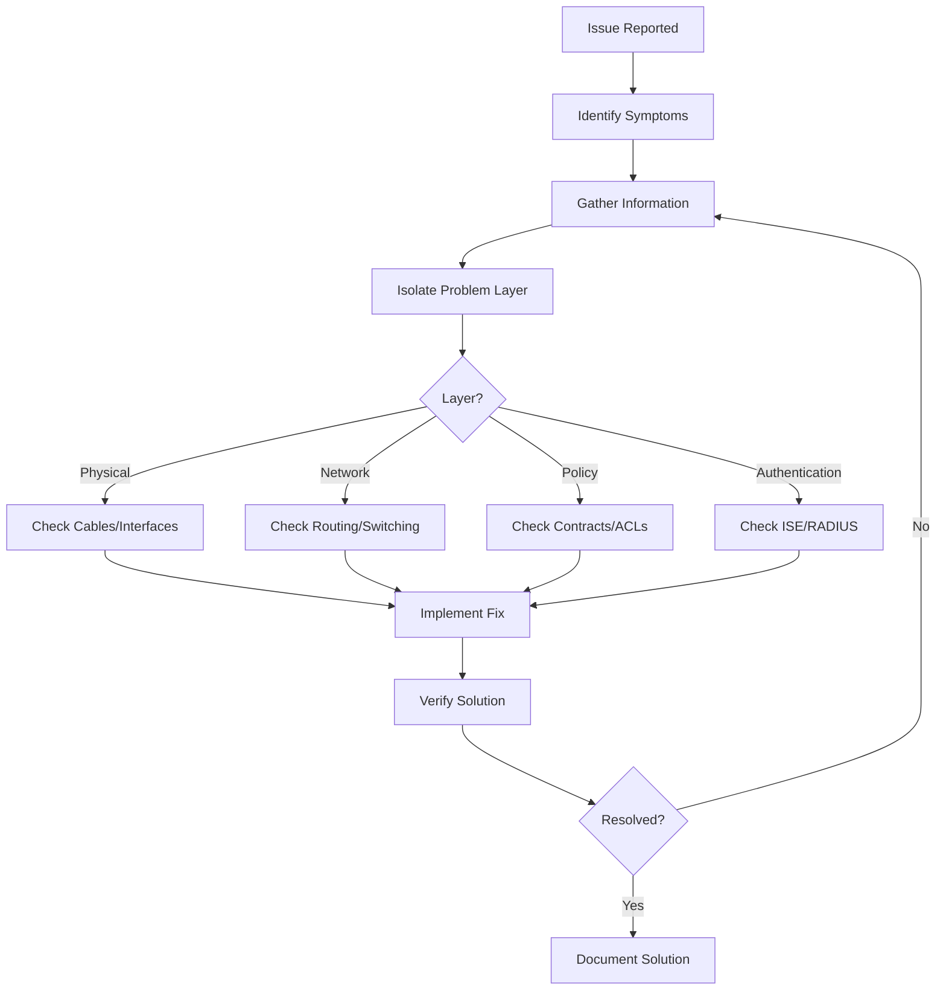
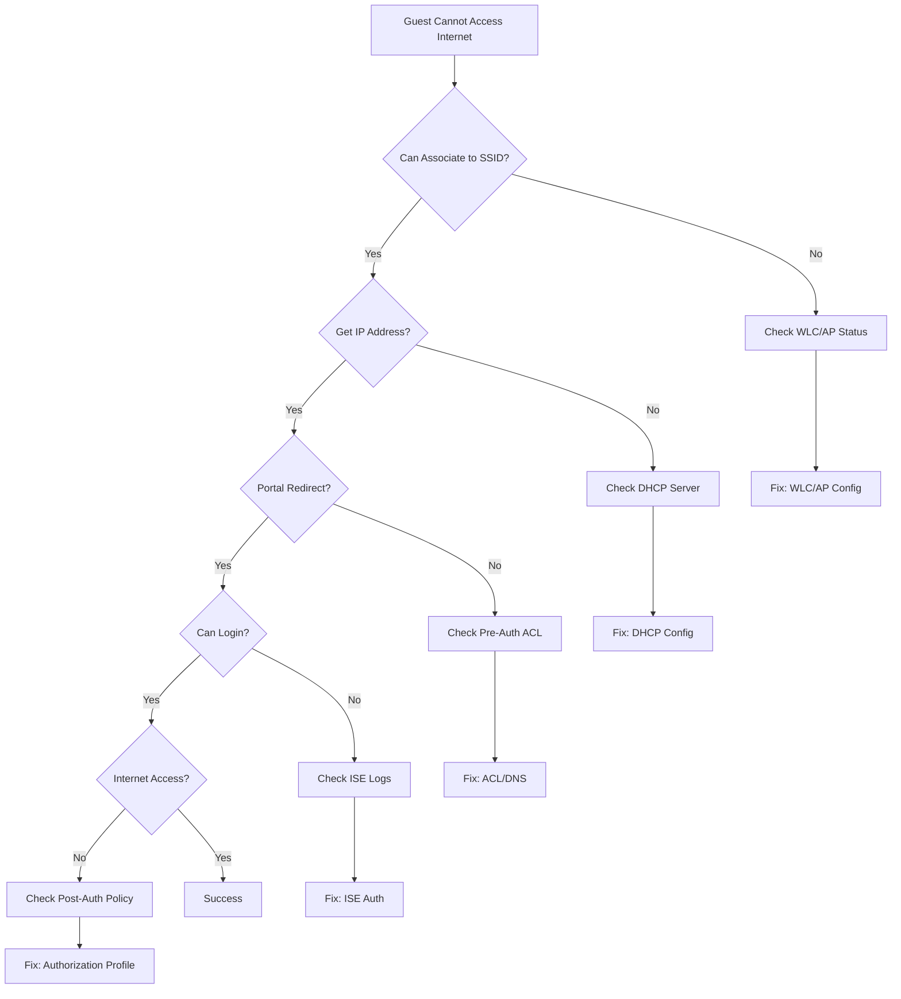
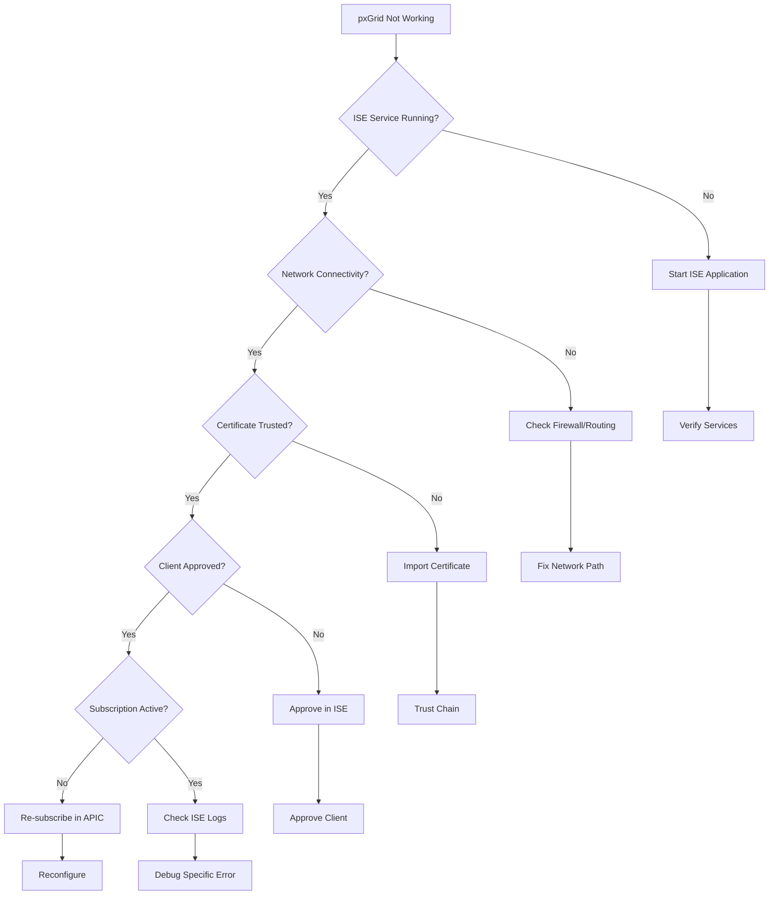

# Cisco ACI + ISE Troubleshooting Guide

**Document Version:** 1.0  
**Last Updated:** October 10, 2025  
**Status:** ✅ Production Ready

---

## 📋 Table of Contents

- [Troubleshooting Methodology](#troubleshooting-methodology)
- [Common Issues](#common-issues)
- [ACI Issues](#aci-issues)
- [ISE Issues](#ise-issues)
- [Integration Issues](#integration-issues)
- [Log Analysis](#log-analysis)
- [Diagnostic Commands](#diagnostic-commands)

---

## 🔍 Troubleshooting Methodology

### Systematic Approach



### Seven-Step Process

1. **Define the Problem** - What exactly is failing?
2. **Gather Information** - Logs, configs, topology
3. **Analyze Information** - Identify patterns
4. **Eliminate Variables** - Test one thing at a time
5. **Propose Hypothesis** - What do you think is wrong?
6. **Test Hypothesis** - Verify your theory
7. **Resolve and Document** - Fix it and record the solution

---

## 🚨 Common Issues

### Issue 1: Captive Portal Not Redirecting

**Symptom:**
- Client connects to guest WiFi
- Browser does not redirect to ISE portal
- No portal page appears

**Diagnostic Steps:**

```bash
# 1. Check client IP address
# Client should have IP from pre-auth VLAN

# 2. Verify WLC redirection ACL (from WLC CLI)
show wlan id 3
# Look for: "Web Policy-Auth" or "Pre-Authentication ACL"

# 3. Check DNS resolution
nslookup www.cisco.com
# Should resolve to ISE portal IP

# 4. Verify ISE portal service
# From ISE CLI
show application status ise
# Portal service should be "running"

# 5. Check ISE live logs
# ISE GUI: Operations > RADIUS > Live Logs
# Look for MAB authentication attempt
```

**Common Causes:**

| Cause | Solution |
|-------|----------|
| ACL blocking HTTP/HTTPS | Modify pre-auth ACL to permit tcp/80, tcp/443 |
| DNS not configured | Add DNS server to pre-auth ACL permit list |
| Certificate mismatch | Ensure portal certificate CN matches FQDN |
| Portal service down | Restart ISE application: `application stop ise` then `application start ise` |
| Client already cached | Clear browser cache or use incognito mode |

**Resolution Steps:**

```bash
# WLC - Fix ACL
config wlan acl <wlan-id> pre-auth-acl GUEST_PREAUTH_ACL

# Create ACL if missing
config acl create GUEST_PREAUTH_ACL
config acl rule add GUEST_PREAUTH_ACL 1
config acl rule action GUEST_PREAUTH_ACL 1 permit
config acl rule protocol GUEST_PREAUTH_ACL 1 17
config acl rule destination port range GUEST_PREAUTH_ACL 1 53 53
# Repeat for DNS, HTTP, HTTPS, DHCP
```

---

### Issue 2: Authentication Failing at ISE

**Symptom:**
- Portal redirects successfully
- User enters credentials
- "Authentication failed" error

**Diagnostic Steps:**

```bash
# 1. Check ISE RADIUS Live Logs
# ISE GUI: Operations > RADIUS > Live Logs
# Filter by username or MAC address

# 2. Look for failure reason
# Common failures:
# - 11007: User not found
# - 11006: Password mismatch
# - 11025: Account expired
# - 11023: Maximum sessions exceeded

# 3. Verify identity store
# ISE: Administration > Identity Management > External Identity Sources
# Test connection to AD/LDAP

# 4. Check user account status
# ISE: Context Visibility > Endpoints
# Search for MAC address, verify status
```

**Common Causes:**

| Failure Code | Cause | Solution |
|--------------|-------|----------|
| 11007 | User not found | Verify username, check identity store sequence |
| 11006 | Wrong password | Reset password, verify password policy |
| 11025 | Account expired | Extend account validity |
| 11023 | Max sessions | Disconnect old sessions or increase limit |
| 22056 | Certificate error | Install trusted certificate |

**Resolution Example:**

```bash
# Extend guest account via ISE CLI
ise/admin# application configure ise
[ise-pxGrid-11.11.11.11] configure# guest-user update username guest12345
[ise-pxGrid-11.11.11.11] configure# valid-days 7
[ise-pxGrid-11.11.11.11] configure# exit

# Or via GUI:
# Operations > RADIUS > Live Logs > Click Failed Auth
# View Details > Repeat > Change Valid Days
```

---

### Issue 3: Endpoints Not Learning in ACI

**Symptom:**
- Physical server connected to leaf
- No endpoint appears in EPG
- Ping/connectivity fails

**Diagnostic Steps:**

```bash
# 1. Check interface status on leaf
leaf-201# show interface ethernet 1/10
# Should show: "up"

# 2. Check VLAN configuration
leaf-201# show vlan id 100
# Should show interface eth1/10 in member list

# 3. Check endpoint learning
leaf-201# show endpoint
# Search for server MAC address

# 4. Check fabric path
leaf-201# show vpc
# Verify vPC peer link if using vPC

# 5. Verify EPG static binding
# APIC GUI: Tenants > Application Profiles > EPG > Static Ports
```

**Common Causes:**

| Cause | Solution |
|-------|----------|
| Interface down | Check cable, optics, speed/duplex |
| VLAN mismatch | Verify VLAN on server NIC matches EPG static binding |
| No static binding | Add static path binding in APIC |
| Learning disabled | Enable endpoint learning on BD |
| Fabric issue | Check spine-leaf connectivity |

**Resolution:**

```bash
# Fix from APIC
# Add static path binding
# GUI: Tenants > Prod > App Profiles > Three-Tier > Web-EPG
# Static Ports > Deploy Static EPG
# Path: Pod-1/Node-201/eth1/10
# VLAN: 100
# Mode: Regular (trunk) or Untagged (access)

# Verification
leaf-201# show endpoint vrf Production:Production-VRF
```

---

### Issue 4: pxGrid Connection Failure

**Symptom:**
- ISE integration configured in APIC
- pxGrid status: "Disconnected"
- Dynamic EPG assignment not working

**Diagnostic Steps:**

```bash
# 1. Check ISE pxGrid service
# ISE CLI:
show application status ise
# pxGrid should show "running"

# 2. Verify certificate trust
# APIC GUI: Admin > AAA > Security > Public Key Management
# Check if ISE certificate imported

# 3. Check network connectivity
# From APIC:
ping <ISE-IP>
traceroute <ISE-IP>

# 4. Verify firewall rules
# Port 8910 TCP must be open APIC <-> ISE

# 5. Review pxGrid logs
# ISE CLI:
show logging application pxgrid/pxgrid.log tail
```

**Common Causes:**

| Cause | Solution |
|-------|----------|
| Certificate not trusted | Re-import ISE certificate to APIC |
| pxGrid service down | Restart pxGrid on ISE |
| Firewall blocking | Allow TCP/8910 between APIC and ISE |
| Wrong credentials | Verify pxGrid admin username/password |
| ISE node not approved | Approve APIC subscription in ISE |

**Resolution:**

```bash
# Restart pxGrid service on ISE
ise/admin# application stop ise
# Wait 2 minutes
ise/admin# application start ise

# Approve APIC client in ISE
# ISE GUI: Administration > pxGrid Services > Clients
# Find APIC client > Approve

# Re-import certificate in APIC
# APIC GUI: Admin > AAA > Security > Public Key Management
# Delete old ISE cert > Import new cert from ISE
```

---

### Issue 5: Traffic Blocked Between EPGs

**Symptom:**
- Endpoints learned correctly
- Same-EPG communication works
- Cross-EPG communication fails (e.g., Web to App tier)

**Diagnostic Steps:**

```bash
# 1. Verify contract relationship
# APIC GUI: Tenants > Contracts > Web-to-App
# Check: Consumer = Web-EPG, Provider = App-EPG

# 2. Check zoning rules
leaf-201# show zoning-rule
# Look for contract name and EPG names

# 3. Verify filter rules
# APIC GUI: Tenants > Contracts > Filters
# Ensure correct ports/protocols allowed

# 4. Check policy usage
leaf-201# show system internal policy-mgr stats

# 5. Test with contract scope
# Verify contract scope (VRF, tenant, global)
```

**Common Causes:**

| Cause | Solution |
|-------|----------|
| Contract not applied | Apply contract to consumer/provider EPGs |
| Filter incorrect | Update filter to allow required ports |
| Wrong direction | Check if EPG is consumer vs. provider |
| Contract scope issue | Verify contract scope matches EPG location |
| Deny rule present | Remove or reorder deny rules |

**Resolution:**

```bash
# Apply contract via APIC GUI
# Tenants > App Profiles > EPG > Contracts
# Consumer EPG: Add "Web-to-App" as Consumed Contract
# Provider EPG: Add "Web-to-App" as Provided Contract

# Update filter if needed
# Tenants > Contracts > Filters > HTTP > Edit
# Add entry: Protocol=TCP, Dest Port=8080

# Verification
leaf-201# show zoning-rule | include Web-to-App
leaf-201# show endpoint detail
```

---

## 🔧 ACI Issues

### Fabric Discovery Problems

**Symptoms:**
- New switches not appearing in fabric membership
- Switches stuck in "Discovering" state

**Troubleshooting:**

```bash
# Check LLDP on spine/leaf
show lldp neighbors

# Verify infrastructure VLAN
show vlan id 4093

# Check fabric ports
show interface brief | include fab

# Verify TEP addresses
show ip route vrf overlay-1
```

**Resolution:**
- Verify physical cabling (spine to leaf)
- Confirm firmware compatibility
- Check infrastructure VLAN not blocked
- Ensure fabric ports not administratively down

### Contract Policy Not Enforcing

**Troubleshooting:**

```bash
# Verify policy mode
leaf# show system internal epm vrf all
# Check if VRF shows "enforced"

# Check hardware programming
leaf# show system internal policy-mgr stats

# Verify TCAM utilization
leaf# show hardware capacity
```

---

## 🔐 ISE Issues

### Portal Service Not Starting

**Symptoms:**
- ISE guest portal URL not accessible
- Service shows "stopped" or "error"

**Troubleshooting:**

```bash
# Check service status
show application status ise

# Review application logs
show logging application ise-psnFailure.log tail

# Check disk space
show system stats disk

# Verify database status
show application status ise
# Look for "DB Connection: UP"
```

**Resolution:**

```bash
# Restart application
application stop ise
# Wait 5 minutes
application start ise

# If disk full, clear old logs
logging disk purge
```

### RADIUS Authentication Slow

**Symptoms:**
- Guest portal redirects slowly
- Authentication takes >10 seconds

**Troubleshooting:**

```bash
# Check PSN load
show cpu platform
show memory

# Review authentication report
# ISE GUI: Operations > Reports > Diagnostic
# Run "Radius Accounting" report

# Check external identity store latency
# Test AD connection response time
```

**Resolution:**
- Add additional PSN nodes
- Optimize AD queries (reduce attributes retrieved)
- Enable caching for frequently accessed data
- Review and tune logging levels

---

## 📊 Log Analysis

### ISE RADIUS Live Logs

**Location:** ISE GUI > Operations > RADIUS > Live Logs

**Key Fields:**
- **Identity** - Username or MAC address
- **Endpoint ID** - Client MAC address
- **Authorization Profile** - Policy applied
- **Failure Reason** - Why auth failed
- **Network Device** - Which WLC/switch

**Common Failure Reasons:**

| Code | Meaning | Action |
|------|---------|--------|
| 11007 | User not found | Check identity store |
| 11006 | Authentication failed | Verify password |
| 11025 | Account expired | Extend validity |
| 11023 | Max devices reached | Increase limit or disconnect old sessions |
| 22037 | Invalid certificate | Install/renew certificate |

### APIC Faults and Events

**Location:** APIC GUI > System > Faults

**Severity Levels:**
- **Critical** - Service-affecting, immediate action
- **Major** - Significant impact, prioritize
- **Minor** - Limited impact, scheduled fix
- **Warning** - Informational, monitor

**Filtering:**
```
Type: "config" - Configuration issues
Type: "operational" - Runtime issues
Type: "environmental" - Hardware/temp/power
```

### Leaf Switch Logs

```bash
# View recent syslogs
show logging logfile messages

# Filter by severity
show logging logfile messages | include ERR

# Real-time monitoring
show logging monitor

# Specific subsystem
show logging logfile messages | include policy-mgr
```

---

## 🛠️ Diagnostic Commands

### APIC Commands

```bash
# System health
acidiag fnvread

# Replication status
acidiag avread

# Controller status
show controller

# Fabric health
show fabric-health

# Endpoint lookup
moquery -c fvCEp -f 'fvCEp.ip=="10.100.10.50"'
```

### Leaf/Spine Commands

```bash
# Endpoint table
show endpoint

# Endpoint detail
show endpoint mac 00:50:56:ab:cd:ef detail

# Routing table
show ip route vrf Production:Production-VRF

# Contract/policy verification
show zoning-rule

# VXLAN tunnel endpoints
show vxlan interface

# Fabric connectivity
show isis adjacency

# Hardware stats
show hardware capacity
show hardware internal tah utilization

# Policy stats
show system internal policy-mgr stats
```

### ISE Commands

```bash
# Service status
show application status ise

# Database status
show logging application ise/prrt-server.log tail

# pxGrid status
show logging application pxgrid/pxgrid.log tail

# Active sessions
show logging application guest.log tail

# Certificate details
show crypto pki certificates system

# Network device list
show run | include radius-server

# Backup status
show repository all

# System resources
show cpu platform
show memory
show disk

# Version info
show version

# NTP sync
show ntp
```

### WLC Commands (for Guest Access)

```bash
# Show RADIUS configuration
show radius summary

# Show WLAN config
show wlan summary
show wlan id 3

# Show client info
show client summary
show client detail <mac-address>

# Show ACL
show acl summary
show acl detailed <acl-name>

# Debug RADIUS (use carefully in production)
debug client <mac-address>
debug dot1x all enable
debug aaa all enable
```

---

## 🔬 Advanced Troubleshooting

### Packet Capture on Leaf Switch

**Capture traffic between EPGs:**

```bash
# Start packet capture
leaf-201# ethanalyzer local interface inband capture-filter "host 10.100.10.10" limit-captured-frames 100

# View capture
leaf-201# show ethanalyzer local interface inband capture-filter "host 10.100.10.10" limit-captured-frames 100 display-filter "tcp.port == 443"

# Save to file for Wireshark analysis
leaf-201# ethanalyzer local interface inband capture-filter "host 10.100.10.10" write bootflash:capture.pcap
```

### ISE Packet Capture

**Location:** ISE GUI > Operations > Troubleshoot > Diagnostic Tools > TCP Dump

**Configuration:**
```
Interface: eth0 (management)
Host: <WLC-IP>
Port: 1812 (RADIUS auth) or 1813 (RADIUS accounting)
Count: 1000 packets
```

### SPAN Session Configuration (ACI)

**Mirror traffic for external analysis:**

```bash
# Create SPAN session via APIC
# Fabric > Access Policies > Policies > Troubleshooting > SPAN
# Source: EPG (Web-EPG)
# Destination: Interface (eth1/48 to analyzer)
```

---

## 📝 Troubleshooting Flowcharts

### Guest Access Workflow Issues



### pxGrid Integration Issues



---

## 🎯 Quick Reference Tables

### ISE Failure Codes

| Code | Description | Common Fix |
|------|-------------|------------|
| 5405 | Authentication failed | Check password |
| 11007 | User not found | Verify identity source |
| 11006 | Password incorrect | Reset password |
| 11025 | Account expired | Extend validity |
| 11023 | Max sessions | Disconnect old sessions |
| 22037 | Certificate invalid | Renew certificate |
| 22056 | Certificate error | Trust certificate chain |
| 86018 | Profiler error | Check profiling policies |

### ACI Fault Codes

| Code | Description | Action |
|------|-------------|--------|
| F0467 | Fabric link down | Check physical connection |
| F0532 | Contract violated | Review contract config |
| F1394 | EP learning disabled | Enable in BD settings |
| F1475 | Subnet overlap | Change subnet |
| F0103 | APIC cluster unhealthy | Check APIC connectivity |

### TCP Ports Reference

| Port | Protocol | Usage |
|------|----------|-------|
| 443 | HTTPS | APIC GUI, ISE Admin |
| 8443 | HTTPS | ISE Guest Portal |
| 1812 | RADIUS | Authentication |
| 1813 | RADIUS | Accounting |
| 8910 | pxGrid | ISE-APIC Integration |
| 5222 | XMPP | pxGrid messaging |

---

## 🔄 Escalation Procedures

### When to Escalate to Cisco TAC

**Escalate if:**
- Hardware failure suspected
- Software bug confirmed
- Configuration verified correct but not working
- Critical production impact (Severity 1)
- Issue persists after following this guide

**Information to Collect Before TAC Call:**

**ACI:**
```bash
# Generate tech support
acidiag techsupport
# File saved to: /data/techsupport/

# Export running config
moquery -c fvTenant -f 'fv.Tenant.name=="Production"' > config.xml
```

**ISE:**
```bash
# Generate support bundle
backup ISE-backup repository FTP encryption-key Cisco123

# Or via GUI:
# Operations > Troubleshoot > Download Logs > Support Bundle
```

**Information Needed:**
- Exact error messages
- Topology diagram
- Software versions
- Configuration files
- Log files
- Steps to reproduce
- Business impact

### Severity Levels

| Severity | Definition | Response Time |
|----------|------------|---------------|
| **S1** | Production down | 1 hour |
| **S2** | Major impact, workaround exists | 4 hours |
| **S3** | Minor impact | 1 business day |
| **S4** | Info request, enhancement | 2 business days |

---

## 📚 Additional Resources

### Cisco Documentation
- [ACI Troubleshooting Guide](https://www.cisco.com/c/en/us/td/docs/dcn/aci/apic/5x/troubleshooting/cisco-apic-troubleshooting-guide-52x.html)
- [ISE Troubleshooting Guide](https://www.cisco.com/c/en/us/support/docs/security/identity-services-engine/200574-ISE-Troubleshooting-Guide.html)
- [pxGrid Developer Guide](https://developer.cisco.com/docs/pxgrid/)

### Community Forums
- [Cisco ACI Community](https://community.cisco.com/t5/data-center/bd-p/discussions-dc-aci)
- [Cisco ISE Community](https://community.cisco.com/t5/security-identity-services/bd-p/security-identity-services-engine)

### Tools
- [Cisco ACI CLI Tool](https://github.com/datacenter/acicli)
- [ISE ERS SDK](https://github.com/ciscoisesdk/ciscoisesdk)
- [Wireshark](https://www.wireshark.org/)

---

## ✅ Troubleshooting Checklist

### Before Starting
- [ ] Identify exact symptoms
- [ ] Document topology
- [ ] Note when issue started
- [ ] Check if changes were made recently
- [ ] Verify issue affects all users or specific users
- [ ] Collect baseline information

### During Troubleshooting
- [ ] Follow systematic approach
- [ ] Test one variable at a time
- [ ] Document all steps taken
- [ ] Save all log outputs
- [ ] Take screenshots of errors
- [ ] Note configuration changes

### After Resolution
- [ ] Verify solution works consistently
- [ ] Document root cause
- [ ] Update runbook/wiki
- [ ] Share lessons learned
- [ ] Implement preventive measures
- [ ] Create monitoring alerts

---

*Last updated: October 10, 2025*